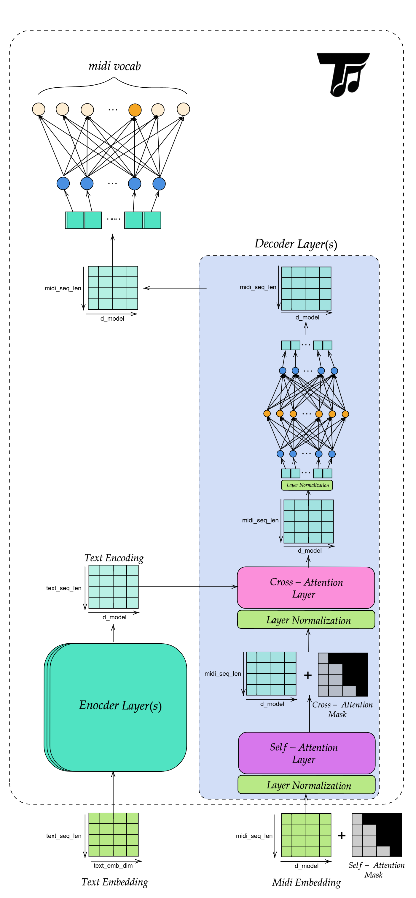

# Transformer Module

This module contains the core transformer blocks used by the MIDI generation stack.

## `Transformer`

The [`Transformer.py`](Transformer.py) module provides the shared building blocks used by the decoder and other transformer-style models.

### `MultiHeadAttention`

Multi-head attention projects queries, keys, and values into multiple heads, applies scaled dot-product attention in each head, then concatenates the result back to `d_model`.

#### Inputs

- `q`: `(batch_size, seq_len_q, d_model)`
- `k`: `(batch_size, seq_len_k, d_model)`
- `v`: `(batch_size, seq_len_v, d_model)`
- `mask`: optional boolean mask where `True` entries are masked out

#### Output

- `(batch_size, seq_len_q, d_model)`

> [!NOTE]
> The attention block requires `d_model` to be divisible by `num_heads`.
> It is used both for masked self-attention and for cross-attention.

### `PointwiseFFN`

The feed-forward block applies a position-wise two-layer MLP to each token representation independently.

#### Inputs

- `x`: `(batch_size, seq_len, d_model)`

#### Output

- `(batch_size, seq_len, d_model)`

> [!NOTE]
> The intermediate size is `d_ff`.
> This block expands features, applies `ReLU`, and projects back to `d_model`.

## `MidiTransformer`

[`MidiTransformer.py`](MidiTransformer.py) defines the text-conditioned encoder-decoder model used for MIDI token generation.

### Purpose

`MidiTransformer` learns a distribution over the next MIDI token at each decoder position while conditioning on encoded text.

### Architecture

The diagram below shows the flow used by the conditional MIDI transformer model:

1. Text tokens are embedded and encoded into a contextual memory tensor.
2. MIDI tokens are embedded and passed through masked self-attention.
3. The decoder cross-attends to the encoded text memory.
4. A final linear layer projects decoder states to MIDI vocabulary logits.

### Main components

- **Text embedding**: converts text token IDs to `d_model` vectors.
- **Text positional encoding**: injects absolute order information into the text sequence.
- **Text encoder**: produces a contextual memory tensor from the text sequence.
- **MIDI embedding**: converts MIDI token IDs to `d_model` vectors.
- **MIDI positional encoding**: injects order information into the MIDI sequence.
- **Transformer decoder**: applies masked self-attention over MIDI tokens and cross-attention over text memory.
- **Final projection**: maps each decoder state to MIDI vocabulary logits.

### Methods

#### `tokenize_text(text, device="cpu")`

Tokenizes raw text using the Flan-T5 tokenizer and returns token IDs together with a padding mask.

Returns:

- `text_tokens`: `(batch_size, text_seq_len)`
- `text_padding_mask`: `(batch_size, text_seq_len)` with `True` at padded positions

#### `generate_causal_mask(seq_len, device=None)`

Creates an upper-triangular boolean mask for autoregressive decoding.

Returns:

- `(seq_len, seq_len)` boolean mask with `True` above the diagonal

#### `encode_text(text_tokens, text_padding_mask=None)`

Embeds text tokens, adds positional encoding, applies dropout, and runs the encoder.

Returns:

- `memory`: `(batch_size, text_seq_len, d_model)`

#### `forward(text_tokens, midi_tokens, tgt_mask=None, text_padding_mask=None)`

Runs the full conditional forward pass.

Flow:

1. Encode text into `memory`.
2. Embed MIDI tokens and add positional encoding.
3. Decode with masked self-attention and text cross-attention.
4. Project decoder states to MIDI vocabulary logits.

Returns:

- `(batch_size, midi_seq_len, midi_vocab_size)`

#### `generate(text_tokens, start_token_id, max_len=512, temperature=1.0, top_k=None, text_padding_mask=None, device="cpu")`

Autoregressively samples MIDI tokens one step at a time.

How it works:

1. Encode the text once.
2. Seed generation with the start token.
3. At each step, decode the current prefix.
4. Use the last position's logits to sample the next token.
5. Append the token and repeat until `max_len`.

Returns:

- `(batch_size, generated_seq_len)`

### Samples

**Sample 1:**

*Prompt:* A slow relaxing and happy melody with a steady rhythm, perfect for a sunny day at the beach.

<audio controls>
	<source src="../../../samples/midi_transformer_generated_melod_1.wav" type="audio/wav">
	Your browser does not support the audio element.
</audio>

**Sample 2:**

*Prompt:* A brighter melodic variation with a stronger rhythmic pulse.

<audio controls>
	<source src="../../../samples/midi_transformer_generated_melody_2.wav" type="audio/wav">
	Your browser does not support the audio element.
</audio>

> [!NOTE]
> The audio of the model could be enhanced using large number of layers and training of huge datasets.
> In this example, we trained the model on 10000 instances from Midicaps dataset for around 40 epochs.